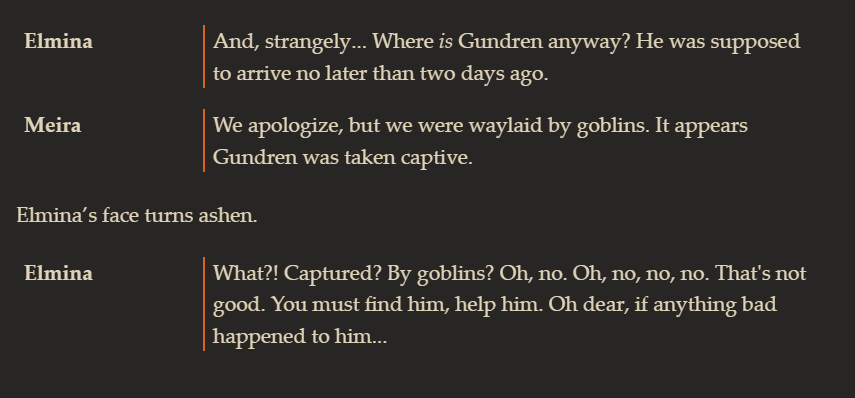
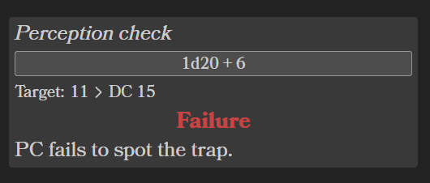

# Obsidian Solo RPG Toolkit

A work-in-progress plugin for Obsidian that provides a suite of tools to enhance the use of Obsidian for solo roleplaying.

Currently it provides two tools: [Dialogue](#dialogue) and [Roll block](#roll-block).

## [Dialogue](#dialogue)

Renders a code block as a simple container. The block parses the first line as the character's name (up to the first newline). All remaining text is parsed as Markdown and will appear on the right side.

<pre>
```rpg-dialogue
@[Name]
[Markdown supported text]

![Inline action]

@[Another Name]
[More dialogue]
```
</pre>

### Example

<pre>
```rpg-dialogue
@Elmina
And, strangely... Where *is* Gundren anyway? He was supposed to arrive no later than two days ago.

@Meira
We apologize, but we were waylaid by goblins. It appears Gundren was taken captive.

!Elmina’s face turns ashen.

@Elmina
What?! Captured? By goblins? Oh, no. Oh, no, no, no. That's not good. You must find him, help him. Oh dear, if anything bad happened to him...
```
</pre>



## [Roll block](#roll-block)

Parses a code block to render a game-agnostic roll block. Values are entered in a YAML block.

Roll blocks style the value of `result` depending on its value. Default values are:

- Success
- Succeed
- Succeeds
- Failure
- Fail
- Failed

You can add custom labels in the plugin settings. You can enter your desired text and choose a color. As long as the value of `result` contains one of the default or custom labels, its corresponding style will be applied. For example, `Exceptional Success` will work because it has the word `Success` in it. Labels are case-insensitive.

### Example

<pre>
```rpg-roll
type: Perception check
formula: 1d20 + 6
total: 11
target: DC 15
result: Failure
outcome: PC fails to spot the trap.
```
</pre>


